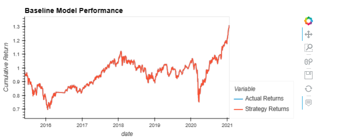
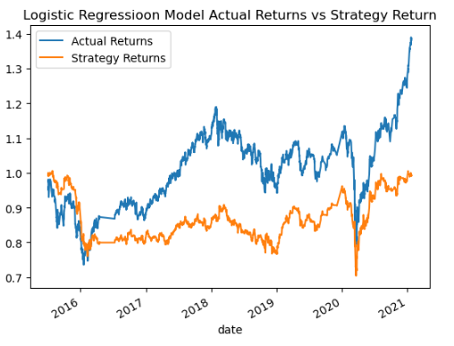

# module_14_challenge

# 3 Months of data
## Original Model Performance
## Short SMA = 4 days and  Long SMA = 100 days, training window = 3 months

                      precision    recall  f1-score   support

             0.0       0.43      0.04      0.07      1804
             1.0       0.56      0.96      0.71      2288

        accuracy                           0.55      4092
       macro avg       0.49      0.50      0.39      4092
    weighted avg       0.50      0.55      0.43      4092
 
   
### Conclusions of Original Model Performance (Question 1):

Looking at the classification report of the original model, as well as graph, strategy returns underperform our benchmarck actual returns. 

## Short SMA = 4 days and  Long SMA = 100 days, training window = 6 months  
    
    
                  precision    recall  f1-score   support

         0.0       0.44      0.02      0.04      1732
         1.0       0.56      0.98      0.71      2211

    accuracy                           0.56      3943
   macro avg       0.50      0.50      0.38      3943
weighted avg       0.51      0.56      0.42      3943
    
 
       
## Short SMA = 4 days and  Long SMA = 100 days, training window = 9 months      
  precision    recall  f1-score   support

         0.0       0.45      0.31      0.37      1616
         1.0       0.57      0.70      0.63      2088

    accuracy                           0.53      3704
   macro avg       0.51      0.51      0.50      3704
weighted avg       0.52      0.53      0.51      3704
 
 
 
 ## Short SMA = 20 days and  Long SMA = 50 days, training window = 3 months      
   
                   precision  recall  f1-score   support

         0.0       0.00      0.00      0.00      1826
         1.0       0.56      1.00      0.72      2321

    accuracy                           0.56      4147
   macro avg       0.28      0.50      0.36      4147
weighted avg       0.31      0.56      0.40      4147

 
 
 
 ## Conclusions of Logistic Regression Model With Best Results (Question 3)

Changing the short term and long term window frame and training windows does impact the result but not much. They look the same unit we change the training windows to more than 9 months

 
## Evaluating a New Machine Learning Classifier

             precision    recall  f1-score   support

         0.0       0.44      0.33      0.38      1804
         1.0       0.56      0.66      0.61      2288

    accuracy                           0.52      4092
   macro avg       0.50      0.50      0.49      4092
weighted avg       0.51      0.52      0.51      4092

 
 
## Final Evaluation: (Question 4)

Overall, it seems that more technical indicators is be needed to get more variety in model performance.
